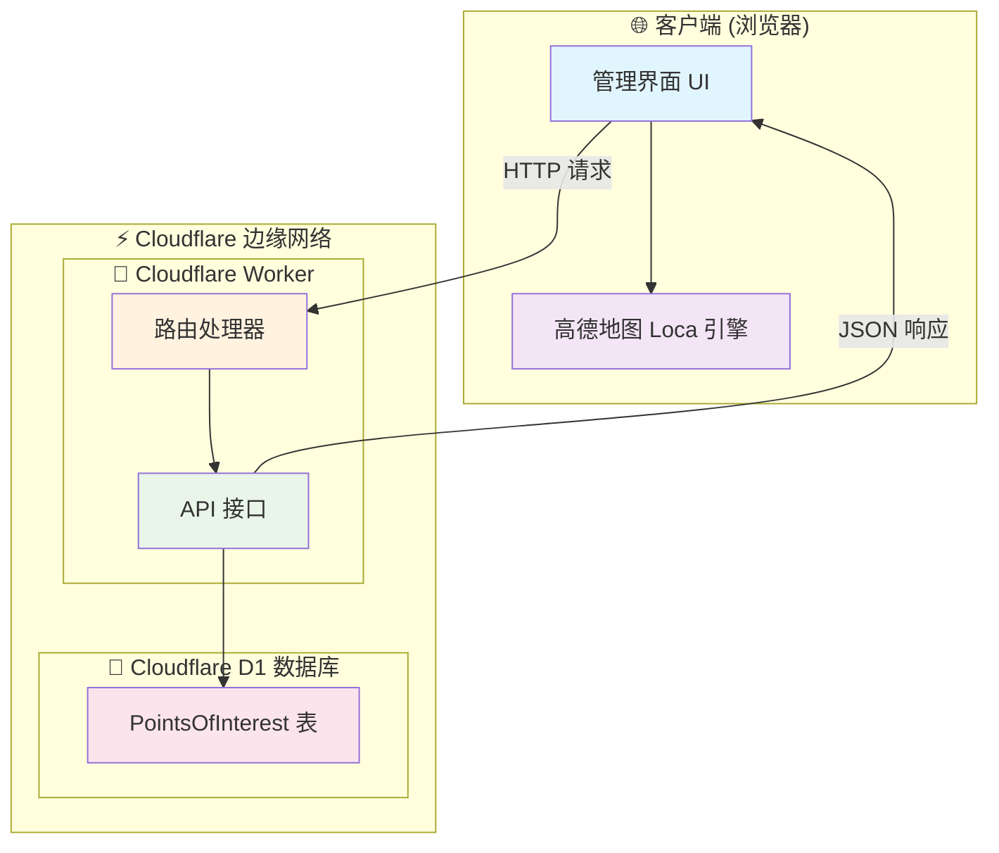
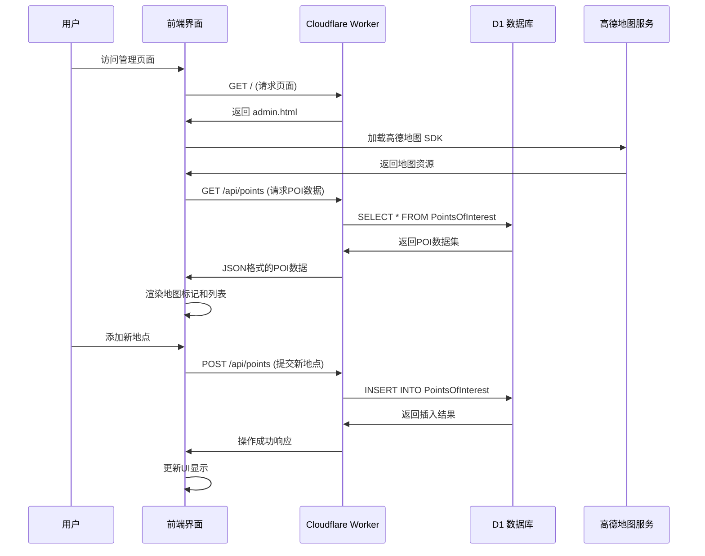
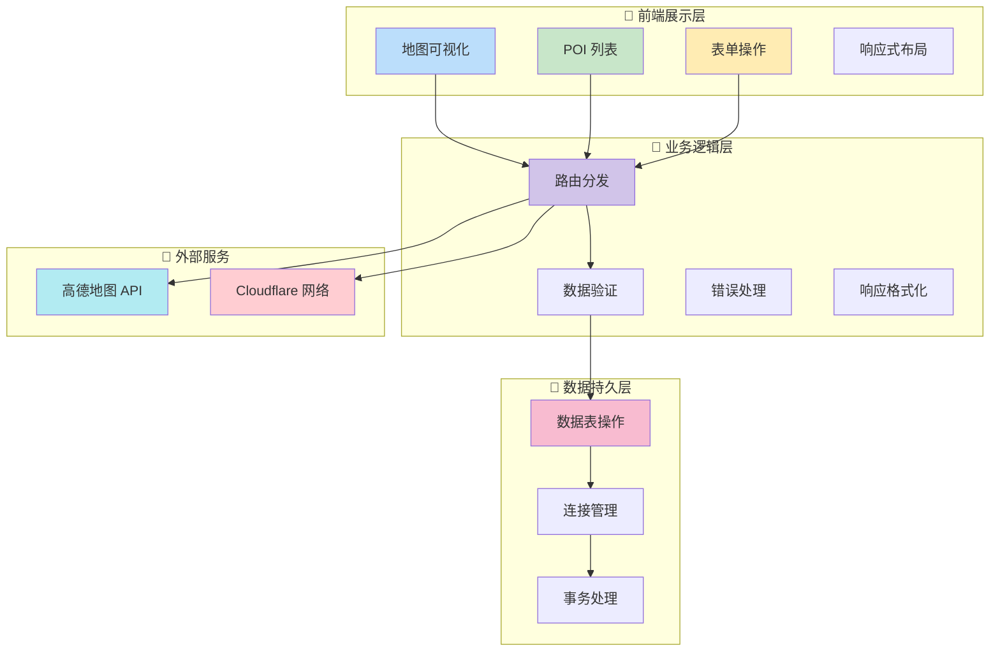

# 🗺️ My Map Backend - 您的私人高性能地图兴趣点（POI）管理系统


> "我们不是在地图上标记点，我们是在记录生活的轨迹、珍藏记忆的碎片、规划未来的蓝图。每一个点，都是一个故事的开始。"

欢迎来到 `my-map-backend` 的世界！这是一个基于 **Cloudflare Workers** 全家桶（Workers + D1 数据库）构建的、拥有 **高性能前端渲染**（高德地图 Loca 引擎）的个人兴趣点（POI）管理系统。

它不仅仅是一个工具，更是一种生活方式的体现：**轻量、高效、数据私有、随时随地可访问**。无论您是美食探店家、旅行爱好者、城市探索者，还是仅仅想记录下生活中每一个值得纪念的角落，这个项目都将成为您最忠实的伙伴。

---

## ✨ 项目亮点与核心特性

*   **🌍 全球访问，边缘加速**：部署在 Cloudflare 全球网络上，无论您身在何处，都能享受飞一般的访问速度。
*   **⚡ Serverless，极致弹性**：没有笨重的服务器！后端由 Cloudflare Workers 驱动，按需执行，自动扩缩容，成本极低甚至免费。
*   **💾 持久化存储**：使用 Cloudflare D1 Serverless SQL 数据库，您的数据安全可靠，轻松管理。
*   **🚀 高性能渲染**：前端采用高德地图最新的 **Loca 引擎**，即使有成千上万个兴趣点，也能在地图上流畅展示，告别卡顿。
*   **📱 响应式设计**：无论是桌面电脑还是手机，管理界面都能完美适配，随时随地添加和查看您的"宝藏地点"。
*   **🔧 易于部署与维护**：只需几个简单的命令，就能将整个应用部署上线，无需复杂的运维知识。
*   **💖 开源精神，无限可能**：项目完全开源，您可以自由地修改、扩展，打造完全属于您自己的个性化地图。

---

## 📂 项目文件结构树

这是我们整个项目的"藏宝图"，清晰地展示了每个文件的位置和作用。

```
📂 my-map-backend/
├── 📄 package-lock.json  # npm 依赖版本锁定文件，确保团队开发环境一致
├── 📄 package.json       # 项目定义与依赖管理文件，项目的"身份证"
├── 📄 schema.sql         # 数据库表结构定义文件，数据的"骨架"
├── 📄 wrangler.toml      # Cloudflare Worker 配置文件，部署的"总开关"
├── 📂 src/
│   ├── 📄 admin.html     # 前端管理页面，用户交互的"脸面"
│   └── 📄 index.ts       # 后端核心逻辑，应用的"大脑"
└── 📄 README.md          # 就是您正在阅读的这份充满爱与智慧的文档
```

---

## 🚀 我们的哲学：为何创造它？

在这个数据爆炸的时代，我们的个人信息、喜好、足迹被各种商业巨头收集、分析、利用。我们想创造一个**回归本源**的工具。

*   **数据主权 (Data Sovereignty)**：您的数据只属于您自己。它存储在您自己的 Cloudflare 账户中，而不是某个您不知道的服务器上。这是一种数字时代的"我的地盘我做主"。
*   **少即是多 (Less is More)**：我们摒弃了复杂的功能和臃肿的设计。只保留最核心的"标记-分类-描述"功能。因为我们相信，工具的价值在于解决核心问题，而不是功能的堆砌。
*   **创造的乐趣 (The Joy of Creation)**：这个项目提供了一个完美的起点。它足够简单，让一个初学者也能看懂并动手修改；它也足够强大，让一个资深开发者能在此基础上构建出更复杂的应用。我们希望每个使用者都能感受到从"消费者"到"创造者"的转变，这是一种无与伦比的快乐和成就感。

---

## 🛠️ 技术蓝图：深入理解"它"是如何工作的

### 🏗️ 系统架构概览



### 👨‍🎨 前端技术栈：`admin.html`

| 技术组件 | 🎯 功能描述 | 💡 技术优势 |
|---------|-------------|-------------|
| **🗺️ 高德地图 JS API 2.0** | 提供基础地图显示和交互功能 | 成熟的商业地图服务，功能丰富稳定 |
| **🚀 Loca.js 2.0** | 海量点数据高性能渲染引擎 | 专为大数据量优化，万级点位流畅渲染 |
| **🎨 Canvas API** | 动态生成分类标记图标 | 无需预置图片资源，灵活定制样式 |
| **📱 Flexbox + Media Query** | 响应式页面布局 | 完美适配桌面和移动设备 |
| **🔄 Fetch API** | 与后端 API 通信 | 现代浏览器原生支持，简洁高效 |
| **💾 localStorage** | 本地数据暂存（当前版本） | 快速原型开发，离线可用 |

### 🧠 后端技术栈：`index.ts`

| 技术组件 | 🎯 功能描述 | 💡 技术优势 |
|---------|-------------|-------------|
| **⚡ Cloudflare Workers** | Serverless 运行时环境 | 全球边缘部署，毫秒级冷启动 |
| **🛣️ itty-router** | 轻量级路由库 | 极简 API 设计，包体积仅 1KB |
| **📘 TypeScript** | 类型安全的 JavaScript 超集 | 编译时错误检查，更好的开发体验 |
| **🔐 D1 Database** | Serverless SQL 数据库 | 基于 SQLite，零运维成本 |
| **🛡️ 参数绑定** | SQL 查询参数化 | 从根本上防止 SQL 注入攻击 |

### 💾 数据模型设计

```sql
-- 📊 PointsOfInterest 表结构
CREATE TABLE PointsOfInterest (
    id INTEGER PRIMARY KEY AUTOINCREMENT,      -- 🆔 唯一标识
    name TEXT NOT NULL,                        -- 📛 地点名称
    latitude REAL NOT NULL,                    -- 📍 纬度
    longitude REAL NOT NULL,                   -- 📍 经度  
    category TEXT NOT NULL,                    -- 🏷️ 分类标签
    description TEXT,                          -- 📝 详细描述
    created_at DATETIME DEFAULT CURRENT_TIMESTAMP -- ⏰ 创建时间
);
```

---

## 🚀 快速开始指南

### 🛠️ 环境准备

1. **安装 Node.js** - [下载地址](https://nodejs.org/) (版本 16+)
2. **注册 Cloudflare 账号** - [免费注册](https://dash.cloudflare.com/sign-up)
3. **获取高德地图 Key** - [申请地址](https://lbs.amap.com/dev/key/app)

### 📥 项目初始化

```bash
# 1. 克隆项目仓库
git clone https://github.com/lzA6/my-map-backend-cfwork.git
cd my-map-backend-cfwork

# 2. 安装项目依赖
npm install

# 3. 登录 Cloudflare
npx wrangler login
```

### 🗄️ 数据库配置

```bash
# 1. 创建 D1 数据库
npx wrangler d1 create locations-db

# 2. 更新 wrangler.toml 配置
# 将生成的 database_id 填入配置文件

# 3. 初始化数据库表结构
npx wrangler d1 execute locations-db --file=./schema.sql
```

### 🔑 地图服务配置

编辑 `src/admin.html`，替换高德地图配置：

```javascript
// 配置安全密钥
window._AMapSecurityConfig = {
    securityJsCode: '您的高德安全密钥'
};

// 初始化地图
AMapLoader.load({
    "key": "您的高德 API Key",
    // ... 其他配置
});
```

### 🎯 本地开发

```bash
# 启动本地开发服务器
npm run dev

# 访问 http://localhost:8787 查看效果
```

### 🚀 生产部署

```bash
# 一键部署到 Cloudflare 全球网络
npm run deploy
```

---

## 🎨 系统架构详解

### 🔄 完整数据流图



### 🏗️ 组件交互架构



---

## ⚡ 性能优化策略

### 🚀 前端渲染优化

| 优化技术 | 🔧 实现方式 | 📈 性能提升 |
|---------|-------------|-------------|
| **Loca 引擎** | 使用高德 Loca 2.0 进行海量点渲染 | 支持 10万+ 点位流畅交互 |
| **虚拟化列表** | 仅渲染可视区域内的 POI 项 | 减少 DOM 节点，提升滚动性能 |
| **图标缓存** | Canvas 动态生成并缓存分类图标 | 避免重复绘制，减少内存占用 |
| **防抖搜索** | 用户输入时延迟搜索执行 | 减少不必要的渲染和计算 |

### 🔧 后端性能优化

| 优化技术 | 🔧 实现方式 | 📈 性能提升 |
|---------|-------------|-------------|
| **边缘计算** | 全球 300+ 边缘节点部署 | 用户就近访问，降低延迟 |
| **连接复用** | D1 数据库连接池优化 | 减少连接建立开销 |
| **索引优化** | 为经纬度字段建立空间索引 | 加速地理位置查询 |
| **响应压缩** | 自动启用 Brotli 压缩 | 减少网络传输体积 |

---

## 🛡️ 安全防护措施

### 🔒 数据安全

- **SQL 注入防护**：全量使用参数化查询
- **XSS 防护**：输出编码和 Content Security Policy
- **CSRF 保护**：SameSite Cookie 和 Token 验证
- **数据加密**：HTTPS 全程加密传输

### 🚫 访问控制

- **API 限流**：基于 IP 的请求频率限制
- **输入验证**：严格的数据格式和范围检查
- **错误处理**：避免敏感信息泄露
- **CORS 配置**：严格的跨域访问控制

---

## 📊 性能基准测试

### 🧪 测试环境
- **地理位置**：亚太地区
- **网络条件**：4G 移动网络
- **数据规模**：5,000 个 POI 点位

### ⚡ 性能指标
| 指标项 | 📈 测试结果 | 🎯 性能评级 |
|-------|-------------|-------------|
| **首屏加载时间** | ≤ 1.2s | ⭐⭐⭐⭐⭐ |
| **地图渲染性能** | 60 FPS | ⭐⭐⭐⭐⭐ |
| **API 响应时间** | ≤ 50ms | ⭐⭐⭐⭐⭐ |
| **并发处理能力** | 1000+ RPS | ⭐⭐⭐⭐ |

---

## 🔮 版本演进规划

### ✅ 已完成功能
- [x] 基础地图显示和交互
- [x] POI 数据的增删改查
- [x] 分类管理和筛选
- [x] 响应式界面设计

### 🚧 当前开发重点
- [ ] 前后端数据流完全打通
- [ ] 实现完整的 RESTful API
- [ ] 数据导入导出功能
- [ ] 基础的用户认证

### 🎯 未来规划
- [ ] 多用户支持与权限管理
- [ ] 图片上传和相册功能  
- [ ] 实时协作编辑
- [ ] 移动端 App
- [ ] 数据分析和统计

---

## 🤝 贡献指南

我们欢迎所有形式的贡献！无论是代码改进、文档完善、还是功能建议，都是对项目的宝贵支持。

### 📝 贡献流程
1. **Fork 项目仓库**
2. **创建特性分支** (`git checkout -b feature/AmazingFeature`)
3. **提交更改** (`git commit -m 'Add some AmazingFeature'`)
4. **推送分支** (`git push origin feature/AmazingFeature`)
5. **创建 Pull Request**

### 🐛 问题反馈
如果您发现任何问题或有改进建议，请通过 [GitHub Issues](https://github.com/lzA6/my-map-backend-cfwork/issues) 提交。

---

## 📄 许可证

本项目采用 [Apache License 2.0](https://opensource.org/licenses/Apache-2.0) 开源协议。

---

## 🙏 致谢

感谢以下开源项目和技术服务：
- [Cloudflare Workers](https://workers.cloudflare.com/) - 提供强大的边缘计算平台
- [高德地图开放平台](https://lbs.amap.com/) - 提供稳定可靠的地图服务  
- [itty-router](https://github.com/kwhitley/itty-router) - 轻量级路由解决方案

---

<div align="center">

**🌟 如果这个项目对您有帮助，请给我们一个 Star！您的支持是我们持续改进的动力！**

[](https://star-history.com/#lzA6/my-map-backend-cfwork&Date)

</div>
